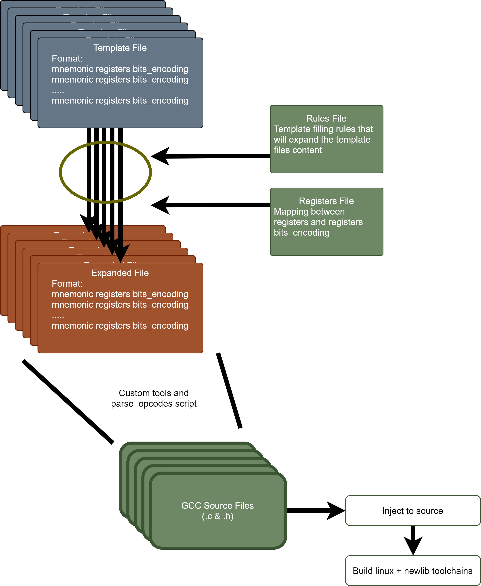

# UVE - Compiler

The Unlimited Vector Extension Toolchain based on GCC. An automatic build system based on configuration files allows for automatic modification, compilation and installation of UVE instructions on the GCC toolchain.

## Setup
Run in the following order:

`git submodule update --init --recursive` : fetches submodules

`./set_repos.sh` : initializes repositories and applies patches

`./inject_uve.sh` : injects UVE templated changes into code

`./configure.sh` : Configures build, builds toolchain and installs.
The toolchain installation path defaults to ../install/uve_tc

## Workflow
After changing the template files, run:
`./rebuild_gas.sh` and answer y after verifying that everything went ok.
This will build the new changes and updates GNU as (assembler) build.

You can force a make clean of GNU as, by executing: `./rebuild_gas.sh 1`

## Documentation
The complete process of injecting UVE instructions in GCC is as follows:

